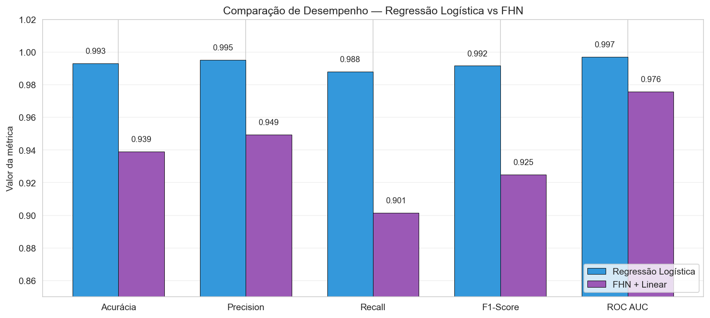
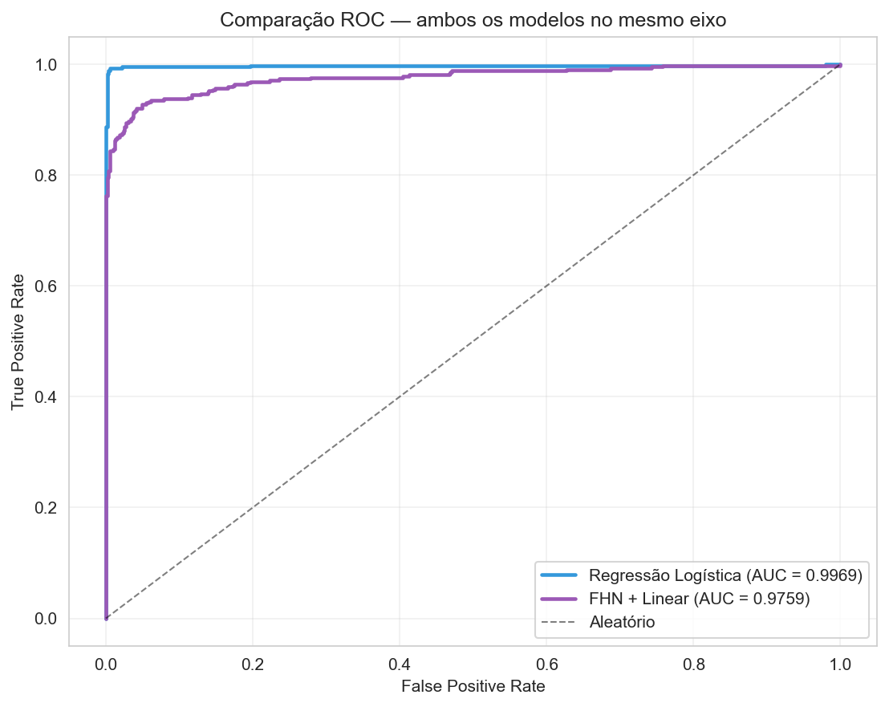

# Relatório Comparativo — IA em Séries Temporais de Saúde
## Regressão Logística vs Rede Neuromórfica FitzHugh–Nagumo na Classificação de Batidas Cardíacas

**CardioIA — Fase 3 — Ir Além 2 | FIAP — Inteligência Artificial**
**Integrantes:** Giulia Bugatti Fonseca (RM 562675), Mahmod Ahmad Issa (RM 561426), Matheus Cardoso Oliveira Lima (RM 565844), Silas Fernandes de Souza Fonseca (RM 564246)

---

### 1. Introdução

Este trabalho aplica duas abordagens distintas de Inteligência Artificial à classificação binária de batidas cardíacas (Normal vs Anormal) em séries temporais de eletrocardiograma (ECG): uma **Regressão Logística (LR)**, modelo estatístico clássico e atemporal, e um pipeline **FitzHugh–Nagumo (FHN) + classificador linear**, modelo bio-inspirado que simula a dinâmica de potenciais de ação. O objetivo é comparar os dois métodos não apenas em performance bruta, mas em interpretabilidade, custo computacional e plausibilidade biológica.

### 2. Dataset

Utilizamos o **ECG5000** (UCR Time Series Archive), derivado do BIDMC Congestive Heart Failure Database do PhysioNet. São 5.000 batidas cardíacas isoladas (univariadas, 140 timesteps cada), originalmente classificadas em 5 classes. Aplicamos binarização (classe 1 → Normal, classes 2–5 → Anormal), gerando uma distribuição de 58,4% Normal vs 41,6% Anormal. Em seguida realizamos um split estratificado 80/20 (4.000 treino, 1.000 teste) com normalização z-score por amostra. Licença: ODC-By — uso acadêmico livre.

### 3. Metodologia

**Modelo 1 — Regressão Logística.** Cada um dos 140 timesteps é tratado como uma feature independente. Treinamos com solver `lbfgs`, regularização L2 (C=1.0), `class_weight='balanced'`. O modelo aprende 140 pesos, um por timestep, sem qualquer noção de ordem temporal.

**Modelo 2 — FHN + classificador linear.** Implementamos o modelo FitzHugh–Nagumo com as equações canônicas:

```
dv/dt = (v − v³/3 − w + I(t)) / τ_v
dw/dt = ε · (v + a − b·w) / τ_w
```

com parâmetros fixos da literatura (a=0,7; b=0,8; ε=0,08; τ=1ms). A simulação foi feita com o framework **Brian2**, padrão em neurociência computacional. Cada batida ECG é injetada como corrente `I(t)` num neurônio FHN, e o trem de spikes resultante é resumido em 8 features estatísticas: número de spikes, intervalo médio entre spikes (ISI), desvio do ISI, tempo do primeiro/último spike, duração da atividade, centroide temporal e diferença de spikes entre as duas metades. Um classificador linear simples (Regressão Logística com 8 pesos) opera sobre essas features. O FHN propriamente dito **não é treinado** — atua como extrator de features biofisicamente plausível.

### 4. Resultados

| Métrica                       | Regressão Logística | FHN + Linear |
|-------------------------------|---------------------|--------------|
| Acurácia                      | **0,9930**          | 0,9390       |
| Precision                     | **0,9952**          | 0,9494       |
| Recall                        | **0,9880**          | 0,9014       |
| F1-Score                      | **0,9916**          | 0,9248       |
| ROC AUC                       | **0,9969**          | 0,9759       |
| Tempo de treino (ms)          | 14,4                | **3,5**      |
| Tempo de inferência (µs/amostra) | **0,42**         | 274,3        |
| Parâmetros aprendíveis        | 140                 | **8**        |

A LR vence em todas as métricas de classificação, com diferença de ≈5,4 pontos percentuais na acurácia. Em termos de eficiência em CPU, a LR é cerca de **700× mais rápida** que o FHN. Em compensação, o FHN opera com uma representação **17,5× mais compacta** (8 features vs 140 timesteps).





Ambos os modelos têm AUC > 0,97, o que indica que o problema é discriminável independente da abordagem. A LR é absurdamente bem-sucedida porque o ECG5000 é, em essência, **linearmente separável** quando tratado como vetor de 140 features. O FHN não chega à mesma performance porque compacta agressivamente o sinal e introduz uma camada de dinâmica não-linear que descarta parte da informação fina.

### 5. Discussão Crítica

A vantagem decisiva do FHN não está nas métricas medidas em CPU, mas em três dimensões **não capturadas** por elas:

1. **Interpretabilidade biofísica.** As 8 features do FHN têm significado neurofisiológico direto — número de disparos, regularidade, timing — e são mais próximas da linguagem cardiológica (ritmo, frequência) do que pesos sobre amostras temporais.
2. **Sensibilidade temporal.** A LR é, por construção, invariante à ordem dos pontos: embaralhar os 140 timesteps de teste (com o mesmo embaralhamento aplicado ao treino) não muda nada. O FHN respeita a temporalidade através da integração da EDO.
3. **Eficiência energética em hardware neuromórfico.** Em chips como Intel Loihi 2 ou IBM TrueNorth, o FHN seria executado nativamente em hardware analógico, com consumo energético ordens de magnitude inferior à multiplicação matricial da LR — o que abre espaço para dispositivos vestíveis ou implantáveis de monitoramento cardíaco contínuo.

**Limitações.** O dataset é pré-segmentado e vem de um único paciente. A binarização agrega 4 patologias distintas, o que pode mascarar limites em multi-classe. Os parâmetros do FHN são fixos — uma otimização específica para a tarefa provavelmente elevaria a acurácia, mas descaracterizaria o modelo como biofísico. A vantagem energética não foi medida diretamente por exigir hardware especializado.

### 6. Conclusão

Os dois modelos resolvem o problema com filosofias distintas. A **Regressão Logística** é a escolha pragmática para CPU com dados limpos: máxima performance, custo computacional mínimo, treinamento trivial. O **FHN + Linear** é a escolha quando importam interpretabilidade biofísica, compactação da representação e potencial de implementação em hardware neuromórfico — mesmo ao custo de ~5 pontos percentuais de acurácia.

Em uma cardiologia futura com sensores vestíveis de baixo consumo, modelos neuromórficos como o FHN podem ser preferíveis precisamente por seu trade-off energético, mesmo perdendo em métricas em CPU. Este trabalho demonstra que tal comparação é viável com ferramentas abertas (Brian2, scikit-learn), e que o FHN — apesar de quase 65 anos de idade — permanece uma ferramenta competitiva para análise de séries temporais biológicas.

### Referências

- Dau, H. A. et al. (2019). *The UCR Time Series Archive*. IEEE/CAA J. Autom. Sin., 6(6), 1293-1305.
- Goldberger, A. L. et al. (2000). *PhysioBank, PhysioToolkit, and PhysioNet*. Circulation, 101(23), e215-e220.
- FitzHugh, R. (1961). *Impulses and physiological states in theoretical models of nerve membrane*. Biophys. J., 1(6), 445-466.
- Stimberg, M., Brette, R., & Goodman, D. F. (2019). *Brian 2, an intuitive and efficient neural simulator*. eLife, 8, e47314.
